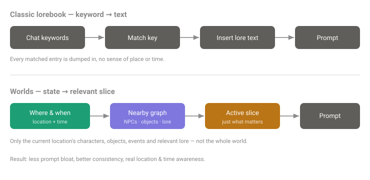
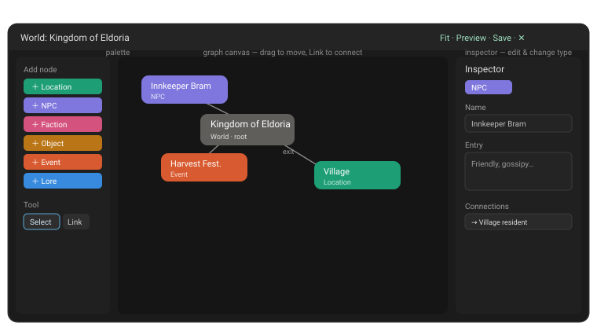
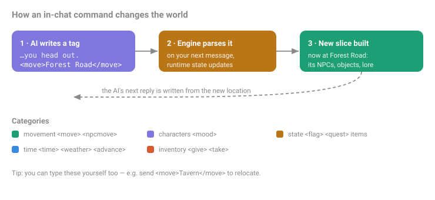

# KLITE RPmod — User Guide

KLITE RPmod adds roleplay tooling to **Esobold Esolite** (a KoboldAI Lite fork):
character panels, a built-in **Guide** for newcomers, and the **Worlds** system —
a living, graph-based world your story can move through. This guide focuses on using it,
with an emphasis on the **in-chat Worlds commands**.

---

## 1. Installing

The mod ships as a single file, `KLITE-RPmod.js`.

1. In Esolite, open the **mod manager** (settings → user mod).
2. Load / paste `KLITE-RPmod.js` and enable it. Reload when prompted.
3. After it loads, RPmod sits around the chat:
   - **Left panel (Adventure)** — *Party* (your persona with class, HP bar, AC and speed from
     its sheet; where, what time; combat status)
     and *Quests* (your active quests, `?` when ready to turn in).
   - **Right panel (tools)** — tabs **World** (the Worlds panel), **Chars**, **Roles**,
     **Scenario** and **Tools**.
   - Bigger views — **Quest log**, **Combat**, **World editor**, **Guide** — open as
     **floating windows** you can drag (title bar), resize (bottom-right corner), maximize
     (square button or double-click the title bar) and close; they remember where you left
     them.
   - The **panels button** in Esolite's top bar (icon with two sidebars) shows/hides both
     panels; the small tabs at the screen edges bring a hidden panel back.

   On wide screens the panels sit beside the chat; on small screens they slide over it
   (one at a time), and on phones windows fill the screen.
   - **Look:** RPmod uses Esolite's own buttons, fonts and colours and follows whatever
     theme you choose in Esolite. In Esolite's *Theme colours* editor you'll also find
     RPmod's own colours (**Rpmod quest / danger / success / info**) to adjust.

That's it — one file contains everything (panels, the Guide, the Worlds engine, and the
Worlds editor).

**New here?** The Adventure panel shows a **New here?** card on your first visit:
- **📖 Open the Guide** — short chapters on everything RPmod does, each with **Show me**
  buttons that open and highlight the part of the screen being explained. Reopen it any time
  with the **?** button in the Adventure panel's header. With a newer Esolite that has its
  own **Guide** in the top bar, RPmod's chapters are the **RPmod** tab of that Guide (next
  to Esolite's own chapters), and the **?** button opens it there. The last chapter,
  **Credits**, lists the sources RPmod builds on (see [Credits](#credits)).
- **▶ Quick Start** — Esolite's own session starter. RPmod adds an **RPmod world** section
  to it: choose a world (for example **Eldoria**, the ready-made example) together with
  characters from your Library, press **Confirm**, and you start in that world.

**Try it in one click.** In the right panel's **World** tab, press **🎁 Load example world** — it
loads a ready-to-play world (a village, a tavern, a guarded frontier road, quests with
givers, an event chain, and a bandit encounter), enables it, and drops you in. Just start
chatting. Everything below explains how to build your own.

---

## 2. What you get

- **Chars / Roles / Scenario / Tools tabs** (right panel): manage characters, personas and
  groups, scenarios, context tools, and image generation.
- **Your characters live in Esolite's Library.** The **Chars** tab imports cards (drop zone),
  makes a backup, creates a card with **New Character** and lists your characters (favorites
  first); **Open character gallery** or a name opens the full-screen gallery (below), where you
  browse, search, play, edit and build. Importing, editing or deleting changes the Library. *Fixed 2026-09-23:* with Esolite 1.35, an older RPmod version
  hid characters you edited or imported in the Chars tab from the Library (their data was
  kept). RPmod now puts such characters back on the list automatically when the page
  loads; if a name was taken meanwhile, the returned one gets `_1` appended.
- **Guide** — RPmod's built-in tutorial (see *New here?* above). The older *Guided RP*
  setup overlay has been retired; Esolite's **Quick Start** plus the Guide replace it.
  Stories saved with Guided RP keep their data.
- **Worlds** — the focus of this guide, below.

---

## 3. What is Worlds?

A classic lorebook dumps in any entry whose keyword appears in the chat — with no sense of
*where* or *when* you are. Worlds instead models a real world (locations, NPCs,
factions, objects, events, a clock) and feeds the AI **only the slice relevant to your
current location and time**.



The result: less prompt bloat, better consistency, and genuine location & time awareness.
Persistent NPCs move on schedules, events fire when their conditions are met, and the world
remembers state (flags, inventory, quest progress) as you play.

Under the hood the mod hands Esolite a compact, per-turn summary through its normal
WorldInfo pipeline — you don't have to manage any of that; it's automatic.

---

## 4. Building a world (the editor)

Open the editor with **✎ Editor** in the right panel's **World** tab.
(No world yet? It'll offer to create one.) It opens as a large window over the chat —
maximize it for the most room, or make it smaller and keep playing next to it. On narrow
screens the palette becomes a strip on top and the inspector moves below the canvas.



- **Palette (left)** — click a type to drop a colour-coded node:
  Location · NPC · Faction · Object · Event · Quest · Lore · Dungeon · Town.
- **Canvas (middle)** — drag nodes to arrange them. Wheel to zoom, drag empty space to
  pan, **Fit** to reframe.
- **Tools** — **Select** (move nodes) and **Link** (click one node, then another, to
  connect them).
- **Inspector (right)** — edit the selected node's name, entry, and type-specific fields;
  review/remove its connections; change its **type**; or delete it.
- **Save** writes the world to your library; **Preview** shows exactly *what the AI will
  see* for your current location.
- **Start of a new game** (select the world node, the root) — the **place**, **time of day**
  and **view** (Player or Creator) a new story in this world begins with. **Use the live
  game's place and time** copies them from where you are now. Choosing the world for a new
  session (Quick Start) starts there, and **Back to start** returns there.
- **Unsaved changes:** until you save, the button reads **Save •** and the World tab shows
  *Unsaved world changes*. **Revert** undoes everything since the last save, including
  deletions. Closing the editor asks whether to save, keep the changes unsaved or revert,
  and the browser warns before you leave the page.
- **Autosave** (off by default): Esolite **Settings → RPmod → Autosave world edits** saves
  about a second after each change. It's convenient, but a deletion is then saved at once
  and can't be reverted.

### Connections carry meaning

You don't label arrows — the editor infers the relationship from the two node types and
writes it into the data:

| Drag between | Becomes |
|---|---|
| Location ↔ Location | an **exit** (both directions) |
| NPC → Location | NPC **lives / is stationed** there |
| NPC → Faction | NPC **belongs to** that faction |
| Object → Location | object **is located** there |
| Object → NPC | object is **owned by** that NPC |
| Event → Location | event **can occur** there |
| Encounter → Location | the fight **waits** there |
| Encounter → NPC | that person **fights** you in it |
| Encounter → Faction | its monsters **belong to** that faction (defeating them costs reputation) |
| Event → Encounter | the event **starts** the fight (it gets a *manual* trigger if it has none) |

So the graph you draw *is* what the AI traverses. Invalid pairs (e.g. NPC → NPC) are
rejected.

**Encounter nodes** (dark red, palette **+ Encounter**) are the saved fights of the world — the
same ones the Combat window saves. The inspector adds SRD monsters by search (− / + for the
count), sets the place and where the enemies start in zone combat, shows the **difficulty** for
your party, and **Start this encounter now** begins the fight. Notes on an encounter are only for
you.

> Tip: after **importing** a lorebook (section 8) everything arrives as grey **Lore**
> nodes. Select one and use the inspector's **type** dropdown to promote it to a Location
> or NPC, then wire up exits.

### Dungeons and towns (room by room)

A place can be a **Dungeon** or a **Town** (palette buttons, or the inspector's **Kind**). It
stays *one node* in the world graph (brown for dungeons, blue for towns, with a room count);
its inside is built in the **dungeon/town editor**, which opens over the world editor
(inspector → **Open dungeon editor**, or double-click the node).

- **Board** — rooms (in a town: places such as the market, temple garden, adventurers' guild,
  bathhouse …) are rectangles on a grid. **Add room** puts a new room next to the selected one
  and connects it. Drag a room to move it; drag its corner to resize it.
- **Connect** — click one room, then another. The direction (north/east/south/west) follows
  where they sit; in a dungeon the connection is a closed door, in a town an open way. The
  inspector sets the direction (also up/down), the type (door, corridor, stairs, secret, open),
  the door state (open, closed, locked, barred), material, lock DC, key item and a **Search DC**
  for secret doors.
- **Room inspector** — name, description, light (bright/dim/dark), hazards, **secret room**,
  its exits, a **way out** to a place in the world (e.g. the crypt entrance on the Forest Road),
  **features** (furniture, containers with contents, traps with a DC, lights), **inhabitants**
  (persons who live there) and an **encounter** of SRD monsters waiting there.
  For **zone combat** (section 6b): the room's **fighting space** (automatic from its size and
  exits, or small room / large space / corridor) and, per feature, its **cover** (automatic from
  the name: pillars, statues, boulders three-quarters, other furniture half) and its **zone**.
- A room can be a **dungeon level** (or town district) with its own map: double-click it;
  the breadcrumbs at the top lead back.
- Nothing selected: the dungeon/town's name, description and **style** (dungeon: stone or
  parchment; town: streets or plots).

Rooms are ordinary places underneath: you can move there, "Go to" objectives, events on
entering, phases and encounters all work for them. **Secret doors and rooms stay hidden from the
AI** until they are found, and the AI only hears about dungeon rooms the player knows.
Deleting a dungeon or town asks first and removes its rooms with it. Rooms the **AI added
during play** (`<room>` tag, below) are world edits like yours: they carry a small **AI** badge
on the board and a note in the inspector — keep, edit or delete them, then Save.

**Generate** (toolbar, or "Generate a dungeon…" in the inspector) fills a dungeon or town for you:

- **Dungeon:** size (small 5, medium 8, large 12 rooms, plus one secret room), theme (**crypt**,
  **cave**, **ruin**, **sewer**), encounters (none / a few / some — SRD monsters of the theme,
  sized for the party level and size you enter) and a **seed**. The rooms are all reachable, with a
  few loops, one **secret room behind a secret door**, doors or passages by theme (caves have no
  doors), one **locked door whose key lies in a chest** on the near side, traps, lights and
  furniture. Rooms get placeholder names ("Room 4"); the AI names each one the first time the
  player is there (see `<room>…, here</room>` below) — or rename them yourself.
- **Town:** tick the places it has (market, temple, temple garden, adventurers' guild, inn,
  bathhouse, smithy, general store, …); they are laid out around the **Town Square**, joined by
  streets.
- **The same seed gives the same map**; the dice button picks a new one. Generating again replaces
  the rooms (you are asked first; never while the player is inside).
- The entrance (dungeon) or square (town) gets a **way out** to the place the dungeon/town is
  connected to in the world editor — connect it there first. A dungeon level inside a dungeon
  gets **stairs up** instead. Without a connection the inspector warns that there is no way out.
- It is a world edit like any other: Save (or autosave) keeps it; Revert throws it away.

Encounters placed in a room (generated or added in the inspector) are listed to the AI as
**waiting here** while the player is in that room, until the fight has been started.

For searching: a secret door or room uses its **Secret DC**, a trap feature its **trap DC**, a
locked door its **lock DC** (each 15 when empty). A door's **key** item unlocks it without a roll.

---

## 5. Playing with a world

From the **World** tab in the right panel:

- Pick a world from the dropdown (or **＋ New**). Each world keeps its own game in the story:
  switching to another world and back continues where you left off; a world you pick for
  the first time begins at its start (and in its view, if it sets one).
- **Play an adventure** (shown when a ready-made adventure is installed) — choose one of its
  pregenerated characters and start: RPmod adds the characters that are not in your Library
  yet (characters already there are never changed), begins a new session with the
  adventure's opening, starts its world in the Player view and makes your choice your
  persona; the others can join you as companions.
- **Enable for this story** — turns the world on for the current chat. (Off = Esolite
  behaves normally; nothing is injected.)
- **Current location** — set where the player is; the slice follows it.
- **Clock** — shows day / time / season, with **⏭** to advance time.

Now just chat. Each turn, the AI receives your current location, the NPCs and objects
there, active events, and relevant lore — and nothing from the far side of the map.

### The map and moving room by room

The left panel's **Map** section shows where you are. Inside a dungeon or town you see its
board with fog:

- the room you are in (gold, with a dot) and rooms you have **visited** (solid);
- rooms you have **seen** but not entered — through an open door or archway — as dashed
  outlines with their name;
- rooms behind a **closed door** as a faint dashed **"?"**: you know something is there, not what
  (its name stays hidden from you and from the AI until you see it);
- unknown rooms and undiscovered secret doors are not shown. In a town every place is common
  knowledge, so its names always show.

Below the board are the exits of your room (direction, name, door state) and a **Search**
button; darkness or dim light shows as a chip.

- **Click a neighbouring room** (or its exit button) to go there. RPmod applies the rules:
  you can only use known exits, a closed door is opened on the way, a **locked or barred door
  refuses the move**. The move or the refusal goes to the game log, and the AI narrates it in
  its next reply.
- Going to a dungeon or town from outside puts you in its entrance room (the room with the way
  out to where you stand). From inside you leave only through a way out.
- Click the small board (or the map icon) to open the large **Map** window; it works the same.
- **Doors:** next to a door's exit button is **Open**, **Close** or **Unlock**. A locked door
  opens with its **key** if you carry it; otherwise, with **thieves' tools** in your inventory,
  RPmod rolls d20 + DEX (+ proficiency when your sheet lists thieves' tools) against the lock's DC.
  Without key or tools it refuses. A **barred** door cannot be opened from your side.
- **Search:** rolls d20 + your better skill of **Perception** and **Investigation** against every
  hidden thing in the room — secret doors, hidden rooms, traps. What you find appears on the map,
  in the exits and in the AI's context; a miss just says "nothing found" (the DCs are never
  shown). Walking in, your **passive Perception** (10 + Perception) already spots whatever it
  beats. Rolls use your persona's sheet, else the world's player stats.
- Every result and refusal goes to the game log, so the AI narrates what actually happened.
- The AI gets your room's description, light, hazards, the exits with exact names (or
  "unexplored room" behind a closed door), directions and door states, and what can be seen
  (unfound secrets and traps stay out). It acts with the exploration tags below — through the
  same rules, as if you had clicked.
- Optional: **Settings → RPmod → Map → Send a small text map to the AI** adds a tiny map of
  the explored rooms (off by default; helps bigger models, may confuse small ones).
- The World tab's **Current location** is the creator's shortcut: it puts you anywhere,
  without the rules.

---

## 6. In-chat commands (Worlds tags)

The world changes as you play through small **tags**. The AI can emit them in its replies
(instruct it to, via your World Rules), or **you can type them yourself**. Tags in the AI's
reply take effect **as soon as the reply arrives** (the panels update at once); tags you type
are applied when you send. Either way the next slice reflects them.



### Command reference

| Command | Example | Effect |
|---|---|---|
| `<move>…</move>` / `<go>…</go>` | `<move>Forest Road</move>`, `<go>north</go>` | Move the **player** to a location. Inside (or into) a dungeon/town RPmod checks exits and doors; a refusal goes to the log |
| `<npcmove>NPC=Loc</npcmove>` | `<npcmove>Captain Rowan=Village</npcmove>` | Move an **NPC** to a location |
| `<mood>NPC=Mood</mood>` | `<mood>Bram=cheerful</mood>` | Set an NPC's mood |
| `<flag>key=value</flag>` | `<flag>metRowan=true</flag>` | Set a story flag (`<flag>key</flag>` = true) |
| `<unflag>key</unflag>` | `<unflag>metRowan</unflag>` | Clear a flag |
| `<give>Item</give>` | `<give>Torch x2</give>` | Add to inventory (`x2` optional) |
| `<take>Item</take>` | `<take>Torch</take>`, `<take>Torch x2</take>`, `<take>Torch x all</take>` | Remove one (or the count, or the whole stack) |
| `<quest>id=state</quest>` | `<quest>find_sword=active</quest>` | Set a quest's state (`done` hides it) |
| `<time>slot</time>` | `<time>evening</time>` | Set time of day |
| `<weather>…</weather>` | `<weather>rain</weather>` | Set the weather |
| `<advance>` | `<advance>` | Advance the clock one step |
| `<action>text</action>` | `<action>pick the lock</action>` | Fire an action signal (triggers `onAction` events) |
| `<roll>expr</roll>` | `<roll>1d20+3</roll>` | Roll dice (logged in combat) |
| `<attack>A-&gt;B</attack>` | `<attack>You-&gt;Goblin</attack>` | Resolve an attack (to-hit vs AC, damage, HP) |
| `<hp>Name=±N</hp>` | `<hp>Goblin=-4</hp>` | Adjust a combatant's HP |
| `<check>Name=abi DC</check>` | `<check>You=dex 12</check>` | Ability check vs a DC |
| `<talk>Name</talk>` | `<talk>Captain Rowan</talk>` | The player spoke with this person (quest objectives) |
| `<join>Name</join>` · `<leave>Name</leave>` | `<join>Oona</join>` | A person here (marked *can join*) travels with the player · parts ways |
| `<rep>Faction=±N</rep>` | `<rep>Royal Guard=+50</rep>` | Change the player's reputation with a faction |
| `<accept>quest</accept>` | `<accept>Bandit Bounty</accept>` | The player takes a quest (if its requirements are met) |
| `<turnin>quest</turnin>` | `<turnin>Bandit Bounty</turnin>` | Hand in a finished quest; rewards are paid |
| `<buy>item</buy>` | `<buy>Torch x2</buy>`, `<buy>Wren: Shield</buy>` | Buy from a vendor here (price, stock and purse are checked) |
| `<sell>item</sell>` | `<sell>Rope</sell>` | Sell to a vendor here at half price |
| `<encounter>…</encounter>` | `<encounter>2 Wolf, Goblin Warrior</encounter>` | Start a fight: SRD monster names with counts, or a saved encounter's name |

### Exploring dungeons and towns (map tags)

Inside a dungeon or town the AI (or you) can also write these. Names or directions come from the
room's exits; articles, case and a plural *s* don't matter, and `door` alone means the only door.
Several tags in one reply run **in order**, so `<unlock>south</unlock><open>south</open><go>south</go>`
works in one go. RPmod applies the rules; refusals and rolls go to the game log.

| Tag | Example | Effect |
|---|---|---|
| `<open>…</open>` / `<close>…</close>` | `<open>north</open>`, `<close>the iron door</close>` | Open or close a door (a locked or barred one refuses) |
| `<unlock>…</unlock>` | `<unlock>south</unlock>` | Key if carried, else a thieves' tools roll; barred refuses |
| `<search></search>` | `<search/>` | Search the current room (Perception/Investigation roll) |
| `<room>Name, dir: text</room>` | `<room>Bone Pit, west: a pit of old bones</room>` | The AI adds a room next to the current one. RPmod places it, names it exactly and joins it by an open door (town: an open way). Refused if that side already has a way; a room with that name is not added twice |
| `<room>Name, here: text</room>` | `<room>Skull Gallery, here: skulls in niches</room>` | Names (and describes) the room the player is in — only while it has a placeholder name like "Room 4"; a named room only takes a description if it has none |
| `<door>dir = …</door>` | `<door>west = locked, iron, DC 15, key: Iron Key</door>` | Gives a way a door or makes it harder (open → closed → locked → barred). It never opens a door — that is `<open>`/`<unlock>`. Material, DC and key only fill in what the creator left empty |
| `<light>…</light>` | `<light>dark</light>` | Light in the current room (bright, dim, dark) for the rest of the story |

**Time slots:** `morning → noon → afternoon → evening → night`. Advancing past night rolls
to the next day, and the **season** follows the month automatically.

**Notes**
- Tags are applied at the **start of your next message**, so a move the AI narrates this
  turn takes effect from the next turn onward — which reads naturally in the story.
- Tags stay in the story text. To **hide them in the chat**, turn on Settings → RPmod →
  Display → **Hide control tags in the chat**: they disappear from the chat as it is shown
  (the game log says what they did), RPmod still reads them, and **Allow Editing** shows them.
  To have the AI use them, add a line to your **World Rules** such as: *"When the scene
  changes location, emit `<move>Name</move>`."*
- Want time to pass automatically every turn? Enable it once in the console:
  `KLITE_RPMod_Worlds.config.advanceClockPerTurn = true`.

---

## 6a. Slash commands

Instead of typing tags you can type **slash commands** in the chat box — the same way you
call Esolite's own custom tools (`/toolname …`). `/help` lists them all, `/help buy` explains
one.

- A command **changes the game at once** and sends nothing to the AI. What happened goes to
  the **game log** (and a short note pops up); the AI reads the log on its next turn. So type
  `/go Forest Road`, then press **Send** with an empty box (the AI continues) or write what you
  do — the AI narrates the real outcome.
- The **rest of the line is the argument**, so names with spaces need no quotes:
  `/buy Bram: Torch x2`, `/accept The Missing Merchant`.
- **Several at once:** separate parts with ` | ` (spaces around the bar) or new lines. Commands
  run first, in order; the other text is sent as your message afterwards:
  `/go Forest Road | I set off before dawn.` If a command is refused, nothing else runs and
  your text stays in the box.
- The rules are the same as for the tags: a locked door, an empty purse or a missing quest
  prerequisite refuses, and the reason is shown.
- If one of **your own Esolite custom tools** has the same name, yours wins. Any other `/…`
  text goes to Esolite unchanged.
- World commands need a world that is loaded and enabled for the story.

| Command | Does |
|---|---|
| `/go <place or direction>` (`/move`) | go somewhere; in dungeons and towns ways out and doors are checked |
| `/look` | where you are: the place, ways out, people and things here (what the AI sees) |
| `/search` · `/open`, `/close`, `/unlock <door>` | search the room; doors (RPmod rolls) |
| `/talk <person>` | you speak with someone (counts for "talk to" objectives) |
| `/join <person>` · `/leave <person>` | someone here travels with you (if they can join) · parts ways |
| `/give <item> [xN]` · `/take <item> [xN \| x all]` · `/inv` | inventory |
| `/buy [vendor:] <item> [xN]` · `/sell …` · `/shop` | trade with a vendor here; the Shop window |
| `/accept`, `/turnin`, `/abandon`, `/track <quest>` · `/quests` | quests; the Quest log |
| `/quest <id>=<state>` · `/rep` · `/rep <faction>=±n` | set a quest state; your standings; change one |
| `/roll <dice> [adv\|dis]` | roll into the game log (`/roll 1d20+3`, `/r d100`) |
| `/check <ability\|skill\|save> [DC] [adv\|dis]` | your persona rolls with its sheet bonus: `/check perception 12`, `/check dex save 14` |
| `/encounter <saved encounter \| 2 Wolf, Goblin>` · `/attack <target> [with <weapon>]` · `/endturn` · `/rest` · `/combat` | fights (reach, range and cover are checked) and the long rest |
| `/time <slot>` · `/advance [n]` (`/wait`) · `/weather <text>` | the clock |
| `/flag <key>[=value]` · `/unflag <key>` · `/action <text>` | story flags and action triggers (for world creators) |
| `/map` · `/sheet [name]` · `/lookup <anything in the SRD>` (`/srd`) | open the Map, a character sheet, the Compendium |
| `/summary` | Esolite's **AutoGenerate Memory**: a summary of the story goes into Memory (check it and press OK) |
| `/help [command]` (`/commands`) | the list |

### Summaries and memory (Esolite's)

Long sessions outgrow the AI's context. RPmod uses Esolite's own tools for that:
- **`/summary`** (or *Context → AutoGenerate Memory* in Esolite) writes a summary of the story
  into **Memory**; check it in the dialog and press OK.
- **Running memory** (Esolite Settings → Esobold → *Enable running memory*, experimental) keeps
  adding short summaries as World Info entries (group "Autogenerated history") while you play.
- **TextDB** (Esolite's Context dialog) lets the AI look things up in long texts.
The world state itself (place, quests, inventory, reputation) never needs a summary: RPmod sends
it every turn.

### Quick replies

The **Quick replies** section at the top of the left panel is a row of one-click replies.
A reply is chat-box text: its commands run, and its message is **sent at once** (an empty one
lets the AI continue) or, if you untick *send at once*, waits in the input box. The pencil opens
the editor (label, text, send at once, move up, remove, Add, Defaults). The defaults are
*Look around* (`/look`), *Search*, *Inventory*, *Rest* and *Continue*; if you had changed the
Tools panel's old **Quick Actions**, those become your first replies (still sent as messages).
Replies are kept in this browser.

Below them, the **Here** row follows the world: the ways out of the current place
(`north: Ossuary`, `→ Forest Road`), the people here (`! Talk: Innkeeper Bram` — with the quest
marker), quests to accept or turn in here, *Shop* when someone trades, and *Search* inside a
dungeon or town. Each one runs the command and sends a short line (`I go to Forest Road.`), so
you can play a whole session by clicking. Switch the row off in Settings → RPmod → Display.

---

## 6b. Tabletop-RPG systems

**Compendium (SRD 5.2.1).** The book button in the right panel's header opens the
**Compendium**: every monster, spell, magic item, piece of equipment (weapons, armor, tools,
adventuring gear) and rules term (the Rules Glossary: conditions, actions, hazards, …) of the
System Reference Document 5.2.1. Search by name, by what the summary says (`cr 1/4`, `wizard`)
or — with four letters or more — by the text; narrow it with the chips. A monster shows its stat
block with **Add** (to one of your world's saved encounters, or a new one) and **Fight it now**.
Spell texts on the sheet and in the builder have an *In the compendium* link; the Combat window
and the encounter inspector have a book button next to each monster.

**Character gallery.** The grid button in the right panel's header opens your whole
Library **full screen**: big portrait cards with name, creator, tagline, tags and size
(tokens) on the image, badges for *You* (your persona), *AI* and a sheet's class and level.
Filter with the tag chips, search, sort (favorites, name, rating, has sheet, size) and switch
between **Large / Medium / Small / List**; your choice is remembered. Click a character for
the full card (description, personality, scenario, first message, example dialogue, creator
notes, sheet) and the actions **Play as (persona)**, **AI plays (chat with)**, **Character
sheet**, **Edit**, **Download**, **Favorite** and **Delete**. **Import** (next to *New
character*) adds cards (PNG, WebP, JSON) with Esolite's own importer. Make the window smaller with
the restore button if you want it next to the chat; it remembers that.

**Sharing cards with SillyTavern.** **Download** gives the portrait PNG with the complete card
inside (a character without a portrait downloads as a complete V2 JSON). SillyTavern keeps
everything — lorebook, alternate greetings, and the **character sheet** stored in the card —
also when you edit the card there; its export (a V3 card) imports back into Esolite with the
sheet intact (tested 2026-09-24). Avoid Esolite Library's own download for characters without
a portrait: it writes a bare JSON that SillyTavern reads as an old V1 card and drops the sheet.

**Character builder (SRD 5.2.1, levels 1–20).** **New character** in the gallery (or **Build
with the SRD rules** on a character without a sheet) walks you through the official
character-creation steps: **Class** (12 classes, start at any level 1–20, with their features,
class resources and the SRD subclass from level 3), **Background** (Acolyte, Criminal, Sage, Soldier — ability increases,
origin feat, skills, tool), **Species** (Dragonborn, Dwarf, Elf, Gnome, Goliath, Halfling,
Human, Orc, Tiefling — with lineage/ancestry choices), **Abilities** (standard array with a
per-class suggestion, point buy with the 27-point budget, or 4d6), **Feats** (from level 4: at
each *Ability Score Improvement* level pick the Ability Score Improvement feat — +2 to one score
or +1 to two, maximum 20 — or another feat such as Grappler, an origin feat or a fighting style;
at level 19 an *Epic Boon*, which can raise a score to 30), **Skills & choices**
(class skills, species skill, expertise, fighting styles, the Cleric's *Divine Order* / the Druid's
*Primal Order*, languages), **Spells** (see below), **Equipment** (the class
and background packages or gold) and **Details & review**, which shows HP, AC, attacks,
skills and spellcasting before anything is saved. It creates a new character in your
Library with the sheet on its card, or puts the sheet on an existing character. **Level up**
on a built sheet rebuilds it one level higher (up to 20), asks only what is new (the new
level's feat, skills, spells) and keeps inventory, coins, notes and your spells; AC
and attacks follow what the character carries now. Every option shows its rules text from the SRD.

**Spells (SRD 5.2.1, 339 spells).** The builder's **Spells** step shows your class's spell list
up to the highest spell level you can cast, with the counts from the class table: cantrips and
prepared spells (a wizard also fills a **spellbook** — 6 spells at level 1, 2 more per level — and
prepares from it). Search the list, tick spells, and open any spell's full text with ⓘ. Spells you
get without choosing are listed as *always prepared* and don't count: species spells (elf
lineages, gnomes, tieflings — choose which ability casts them), the SRD subclass spells (Life
Domain, Oath of Devotion, Draconic Sorcery, Fiend Patron, Circle of the Land by the land type you
choose) and **Magic Initiate** (Acolyte → Cleric list, Sage → Wizard list, or the human's origin
feat / a feat at level 4+: two cantrips and a level 1 spell). Choosing spells is optional there —
you can do it later on the sheet; too many or wrong spells block *Create*.

On the **sheet**, the Spellcasting section lists your spells by level: open one for its text; roll
**Hit** (spell attack), **Dmg** (cantrips grow at levels 5, 11 and 17) or **Heal**; the target's
**save DC** is shown. In a fight, cast from the **Combat** window instead: it rolls against the
targets and spends the slot (see *Combat* below). **Cast** here uses the lowest free spell slot of the spell's level or higher and
writes it to the game log, so the AI narrates it; species and Magic Initiate spells also have a
**Free** cast (once, or a gnome's Proficiency Bonus times, per Long Rest). **Restore slots (Long
Rest)** clears used slots and free casts. **Change spells** (built characters) opens the same
lists to swap cantrips, prepared spells, the spellbook or the land type; level up keeps them. The
text box below is for other spells and notes (scrolls, items).

The sheet also applies a few rules for you (shown under *Combat*): **Alert** adds your Proficiency
Bonus to Initiative (also in fights), a Bard's **Jack of All Trades** adds half of it to skill checks
you are not proficient in, and the Cleric's *Thaumaturge* / Druid's *Magician* add your Wisdom
modifier (at least +1) to Arcana and Religion / Nature checks. *Protector* and *Warden* make you
proficient with Martial weapons (and list the armor training).

**Character sheets.** Every character in your Library can have a d20 sheet (SRD 5.2.1 rules):
species, class, level, background, the six abilities, saving throws, the 18 skills
(proficient or expertise), AC, speed, HP, attacks, inventory, coins, features and notes.
Open it with **Character sheet** in the left panel's *Party* section. It starts with your
persona; pick any character at the top. The *Party* section shows your persona's class, HP
(with a bar), AC and speed; during a fight it shows the combat tracker's HP (marked ⚔). If your
persona has no sheet yet, **Build** starts the character builder for it. Modifiers, the proficiency bonus, initiative and
passive Perception are calculated for you.

- **Click to roll:** every bonus is a button that rolls a d20 with it (choose **Advantage**
  or **Disadvantage** at the top); attacks roll to hit and damage. Rolls appear in the
  **Dice log** (left panel) and are saved with the story. **The AI sees the rolls made
  since its last reply.**
- **Stored in the card:** the sheet lives inside the character card
  (`extensions.klite_rpmod`), so exporting the card from Esolite's Library keeps it, as do
  SillyTavern and Chub. Changes are a draft until you press **Save** (or turn on
  *Autosave character sheets* in Settings → RPmod); **Revert** undoes them.
- **What the AI knows:** your persona's (and the active character's) sheet summary is part
  of the prompt. A world person linked to a card uses that card's sheet in combat if it has
  no stat block of its own.

The **World** tab shows the live game state (enable, game state, location, time, flags,
inventory) and has buttons for the **Quest log** and **Combat** windows and the **Editor**,
plus a **Creator ⇄ Player** lens in its header.

**Game state: start and live game.** For every story RPmod keeps two copies of the world's
state — where you are, time and weather, quests and objectives, flags, reputation, explored rooms,
doors, companions and the story inventory: the **live game** and a **start state** to return to.
Both are saved with the story and its export.

| Button | What it does |
|---|---|
| **Back to start** | The world returns to the start state (replay, or undo a wrong turn). |
| **Save as start** | The world as it is now becomes the new start state — a checkpoint. |
| **Edit start state** | Creator view only: changes now go to the start state (e.g. where a new game begins); **Back to the live game** switches back. |

The example world brings its opening as the start state; in your own world, set up the opening
(place, time) and press **Save as start**. What the start state does **not** reset: the **chat**
(the AI still reads the story so far — start a new session or tell the AI the story begins again),
your **character sheet** (HP, XP, gold and items stay on your card) and the **world itself**
(edits in the editor stay). Tags in messages that were already applied are not applied again
after **Back to start**; only new replies change the world.

**Persons = characters.** In the editor, an NPC can be **linked to a character** from your
Library (its TavernCard text is reused: without a description of its own, the AI gets a short
line from the card's personality or description) and given an optional **d20 stat block**
(abilities, AC, HP, attacks). Stats feed combat and appear in the AI's context near that NPC.

**Companions (the travelling party).** Tick **Can join the party** on a person in the editor.
When you are at the same place, the **Party** section on the left offers **Ask … to join**
(or type `/join Name`, or the AI writes `<join>Name</join>` when they agree). A companion
travels with you, fights on your side (and gets a share of the XP), and appears in the Party
section with their HP; the **✕** button (or `/leave Name`, `<leave>Name</leave>`) lets them go —
they stay where you parted. Only people marked this way can join; monsters never do.

**Quests.** Add **Quest** nodes with a **giver** and a **turn-in** person. Markers show on
persons: yellow **!** = a quest you can accept, yellow **?** = a finished quest to hand in here,
grey **?** = a quest in progress that goes back to this person, grey **!** = a quest for later
(your level is too low). The **Quest log** window is your log: accept, track, complete, turn in,
**abandon**; hidden quests read `???` to the player until discovered. A per-world switch
controls whether the **AI** (as GM) sees hidden content or not.

- **Objectives** count by themselves: *Defeat* (a monster name or a person — every defeat in a
  fight counts, e.g. "Defeat 3 Wolf (1/3)"), *Collect* (items in your inventory; handed over on
  turn-in), *Talk to* (mention the person in the chat while they are there, or the AI writes
  `<talk>Name</talk>`), *Go to* (a place; a zone counts all places inside it) and *Manual*
  (tick it in the Quest log). When all are done the quest is ready to turn in.
- **Rewards** are paid when you turn in: XP, gold and items go to **your persona's character
  sheet**, plus reputation; a *choose one* reward lets you pick in the Quest log. In the editor
  type e.g. `100 xp`, `25 gold`, `Silver Ring x1`, `choose: Longsword | Shield`,
  `rep Royal Guard +100`.
- **Chains and requirements:** a quest can require a level, earlier quests (link quest → quest in
  the editor), flags or a reputation tier. Locked quests cannot be accepted; the player only sees
  the ones that wait for a level (greyed). A quest can also **start from an item** — it appears
  when you pick the item up.
- **Repeat:** a quest can be *repeatable* (available again right after you turn it in) or
  *daily* (available again when a new in-game day begins). Each turn-in pays the rewards again;
  the Quest log shows how often you have done it. For chains and phases it counts as turned in
  from the first time on.
- **The giver's words:** give a quest what the giver says when **offering** it, **while it is
  in progress** and **on turn-in**. The Quest log shows them; the AI hears them under *Quest
  givers here* and speaks the offer in the giver's voice. When you agree in the chat, the AI
  writes `<accept>quest</accept>`, and `<turnin>quest</turnin>` when you hand one in — RPmod still
  checks the requirements and pays the rewards (a *choose one* reward is picked in the Quest log).

**Your inventory is your persona's sheet.** Items, gold and XP from quests, fights and the
`<give>`/`<take>` tags go onto the character card, so they stay with the character in every
story. Without a persona the story keeps them. If you are editing the sheet while a reward
arrives, the reward is merged into your unsaved edits.

**Reputation.** Each faction has a standing from **Hated** through Hostile, Unfriendly,
Neutral, Friendly, Honored, Revered to **Exalted** (Quest log, bottom). Quests, events and the
`<rep>Faction=+50</rep>` tag change it; the AI is told what it means (members of a Hostile faction
are hostile to you, friends give favours) and quests or events can require a tier.
**Defeating a member** of a faction lowers your standing with it: a person of the faction, or a
monster of an encounter linked to it (−25 each unless the faction's inspector says otherwise;
0 turns it off).

**Vendors.** Any person can run a shop: in the editor tick **Vendor** in the person's inspector
and add wares — leave the price empty to use the SRD price (shown in grey), or type one such as
`4 cp` or `2 gp 5 sp`; a **stock** limits how many they sell per in-game day (it refills the next
day). Where a vendor stands, the World tab shows **Trade here … Shop**: the **Shop** window lists
the wares with prices and a **Sell** list of your items the vendor wants (at half price). Your
standing with the vendor's faction changes the prices (Friendly −5 %, Honored −10 %, Revered
−15 %, Exalted −20 %, Unfriendly +25 %); a Hostile faction's vendor will not trade with you. You
pay from your persona's purse (small coins first; you get change). In the chat the AI uses
`<buy>Torch x2</buy>` and `<sell>Rope</sell>` — RPmod checks price, stock and purse, and the log
says what happened. In the example world, Innkeeper Bram and Quartermaster Wren (Royal Guard)
trade.

**Zones, hubs and phasing.** In the editor a place can be **part of** another (a tavern in a
village, a village in a valley); the AI hears "Part of: Brookvale › Millbrook Village" and which
places lie within. Mark busy places as a **hub**. **Phases** change a place, person or faction once
conditions hold — e.g. after the bounty is turned in the bandit camp becomes the *Abandoned
Camp*, the village celebrates, the bandit leader is gone and the Red Hand, scattered, has no
headquarters any more. A faction's phase can rename it, move or remove its headquarters, or
**disband** it (the AI no longer hears of it; your standing is kept). The last matching phase wins.

**Triggers & chains.** Events have **triggers** (on enter / time / flag / quest-state / action
/ another event) and **effects** (set flags, give items, offer quests, move NPCs, fire another
event…). Effects chain, so you can build sequences like *enter the tavern at night → a courier
arrives → he offers a delivery quest*. Wire it all visually in the editor.

**Factions & HQs.** Link a **Faction → Location** to give it a visitable **headquarters**.

**Combat (SRD 5.2.1).** RPmod rolls, the AI narrates.

- **Build an encounter** in the **Combat** window: search the 330 SRD monsters (by name, type or
  challenge rating) and add them with counts; add persons of your world as enemies or allies.
  The **difficulty meter** shows the encounter's XP against your party's budget (SRD table:
  *Low / Moderate / High* for your persona's level and the number of companions). **Save to
  world** keeps an encounter for later (start it from the list, from an event with the effect
  *encounter*, or let the AI start it).
- **Start encounter** rolls initiative. Enemies who act before you take their turns at once.
- **Your turn:** choose weapon (from your sheet), target and normal/advantage/disadvantage,
  press **Attack**, then **End turn** — the enemies' turns are rolled automatically until it is
  your turn again (switch this off in Settings → RPmod → *Run enemy turns automatically*). Then
  write in the chat what your character does; the AI narrates from the combat log.
- **Spells:** if your character (or a companion with a character sheet) has spells, the turn
  panel has **Weapon / Spell**. Choose the spell, the **slot level** (the lowest free one; a
  higher slot adds dice when the spell says so; species and feat spells also offer their *free
  cast*) and the target, then **Cast**. The slot is taken from the character sheet.
  - *Spell attacks* (Fire Bolt, Guiding Bolt) roll against AC like weapons.
  - *Saving throw spells* (Sacred Flame, Burning Hands): each target saves against your spell save
    DC; damage is rolled once, half on a success when the spell says so. For area spells tick every
    creature caught in it.
  - *Healing* (Cure Wounds, Healing Word) adds your ability modifier and wakes a dying ally.
  - *Magic Missile*: three darts (+1 per higher slot) that always hit; spread them over the targets.
  - *Everything else* (Bless, Shield, Hold Person, …) spends the slot and goes to the log for the
    AI to narrate; add its condition under **Tools** if it has one.
  - With zone combat the spell's range counts (Touch = the same zone), and a spell with a casting
    time of an Action uses your action; a Bonus Action spell (Healing Word) does not.
  - Not handled yet: concentration, monsters casting spells, companions casting on their own turns.
- **Companions keep their HP.** Allies from your world start the next fight with the HP they
  ended the last one with — from their character sheet if they have one, else remembered in the
  story. The **Party** section lists them with their HP.
- **Long rest** (Party section, outside a fight): you and your companions get full HP back, and
  your spell slots and free casts are restored. The AI is told.
- **Conditions** (Prone, Poisoned, Restrained, …, from the SRD) change attack rolls
  (advantage/disadvantage, automatic critical hits against the unconscious) and can run for a
  number of rounds. Stunned or paralyzed creatures lose their turn. Add them under **Tools**,
  where you also apply damage or healing and use monsters' special actions (breath weapons:
  saving throw against the DC, half damage on a success).
- **Dropping to 0 HP:** you fall unconscious and make **death saving throws** on your turn
  (10+ succeeds, 1 counts twice, 20 brings you back with 1 HP); damage while down counts as a
  failure. Three successes = stable, three failures = dead.
- **Victory** (every enemy down) awards the monsters' XP, **divided evenly among everyone who
  fought on your side** (SRD: two Goblin Warriors, 100 XP, give you and one companion 50 XP each;
  companions with a character sheet keep their share); **defeat** when no one of the party is
  standing. Your persona's remaining **HP and the XP are saved to its sheet** (the fight also
  starts from the sheet's current HP); when you reach the next level's XP, the log says so and
  **Level up** on the sheet takes you there.
- **The AI sees** the fight state (party, enemies with HP/AC/conditions, whose turn, the outcome)
  and every roll since its last reply, with the instruction not to invent results. Outside a
  fight it is told how to start one: `<encounter>2 Wolf</encounter>`. The older tags `<attack>`,
  `<roll>`, `<hp>` and `<check>` still work.

**Zone combat (positions without a grid).** A fight takes place in the room you are in, split
into a few **zones**; every creature stands in one zone. No grid, no measuring. The Guide has a
tab **Zone combat** with the rules and diagrams of the three layouts (also: *How zone combat
works* in the Combat window).

- **Layouts** (one map square = 10 ft): a **small room** (up to 30 × 30 ft) is one zone; a
  **large space** (bigger rooms, caverns, anything outdoors) has a **centre** and four **sides**
  (north, east, south, west — each side touches the centre and its two neighbours); a **corridor**
  (one square wide) has a middle and only the arms its passages lead to. Every layout also has
  **just outside** (behind the doors) and **out of range**. Doors are drawn on the room's edge.
- **Start:** you stand on the side of the room you came in by (else the centre); enemies start
  across the room, or — chosen in the builder or stored with a saved encounter — right beside
  you, in the next zone or outside.
- **Moving:** one zone per turn (speed 60 ft or more: two). **Flee** moves two zones but allows
  no attack, and enemies in the zone you leave get an **opportunity attack**; a one-zone
  *fighting retreat* is safe. Click a highlighted zone on the board, or pick one and press
  **Move** / **Flee**.
- **Attacks:** melee only in the **same zone** (reach over 30 ft: the next zone); ranged weapons
  with a range of 30 ft or less reach the same or the next zone, longer ones any zone in the line
  of fire (walls block it in corridors; from outside only through a doorway, and only one ranged
  attack per round goes through a doorway). Shooting at an enemy who attacked you in melee within
  the last round: **−3 to hit**. When an attack is not possible, the window says why.
- **Cover** (SRD 5.2.1): **Take cover** behind a feature in your zone — half cover +2 AC,
  three-quarters +5 AC against attacks from other zones.
- **Hide** (SRD 5.2.1, your action): Stealth against DC 15, behind three-quarters cover with no
  enemy in your zone, or in a dark room. Success = **Invisible** (attacks against you with
  disadvantage, yours with advantage) until you attack or an enemy finds you with **Search**
  (Perception against your Stealth total).
- **Enemies** follow the same rules: melee fighters close in (and dash when too far), archers
  step out of melee, take cover and shoot, and enemies who see no one search.
- The board shows everyone as tokens (blue = party, red = enemies, gold ring = whose turn),
  doors on the edge and features that give cover; the AI gets the battlefield (zones with doors
  and terrain) and each combatant's zone and cover.
- **Tools → Put there** places a creature in a zone without rules (game-master fix).
- Switch zones off in Settings → RPmod → **Zone combat**: everyone can reach everyone again.
  A fight already running keeps its mode; fights saved before zones existed keep working.

---

## 7. What the AI actually sees

Everything RPmod adds to the prompt comes from one place and is added fresh for each
turn: the world slice, plus your **persona** and the **AI character** when you've enabled
them in the **Tools** tab (in group chat, the character whose turn it is). A character
described there in full is only *listed* under Nearby NPCs, not repeated.

Click **👁 Preview what the AI sees** in the World tab (or **Preview** in the editor, or
run `KLITE_RPMod_Context.preview()` in the console) to see it all, e.g.:

```
[World Rules]
Medieval fantasy tone.

[Current Time]
Day 1, spring (morning). Weather: clear.

[User Character: Mira]
Description: A ranger from the north.

[Current Location: Village]
A small farming village.
Exits: Forest Road

[Nearby NPCs]
- Innkeeper Bram | friendly, gossipy

[Relevant Lore]
The King rules from the distant capital.
```

Sections are prioritised (rules, time, persona/character, player state, location, NPCs,
objects, events, lore). They go in as Esolite World Info entries, so Esolite's context
meter counts them and its World Info budget applies. They are never saved into your story.
Things you set up on purpose (characters loaded into Memory or World Info with **Start
RP**, Esolite's Quick Start) stay ordinary story data you can edit.

---

## 8. Import & export

In the **World** tab:

- **Import** reads a **World JSON**, a **lorebook** (SillyTavern World Info, Lorebook V3, the
  `character_book` of a V2/V3 card) or an **Esolite WorldInfo** file.
  - A lorebook that RPmod exported carries the whole world. RPmod asks whether to **restore it
    as its own world** (a copy — your existing worlds are never overwritten; the name gets
    "(imported)" if it is taken) or to add its entries to the active world. Text you changed in
    its entries elsewhere (e.g. in SillyTavern) is taken over; new entries become Lore.
  - Other lorebooks: entries that start with a header like `[Location: Pier]` become that kind
    of node (Location, Character, Faction, Object, Event, Quest); the rest become **Lore** nodes
    with their keys (promote them in the editor). Entries that were switched off stay off (they
    are not sent to the AI until you enable them).
- **Export** opens a list of formats:
  - **World JSON** — everything, for RPmod.
  - **Lorebook (SillyTavern / Esolite)** — a World Info file: one entry per place, person,
    faction, object, event, quest and lore node, each with its header line. SillyTavern and
    Esolite's own WorldInfo import read it; RPmod restores the world from it.
  - **Lorebook V3** — the same as a `lorebook_v3` file.
  - **Esolite WorldInfo** — the flat WI array (also vanilla KoboldAI Lite).
  - **Save to Esolite's Library** — stores the world as a *World Info* entry in Esolite's
    Library, so Quick Start can load it into a story.

Worlds are stored in your browser (IndexedDB); the per-story runtime state (where you are,
flags, inventory, clock) is saved inside the story savefile automatically. Your saved
stories never contain the temporary injected entries.

---

## 9. RPmod settings

RPmod's options are in Esolite's own **Settings** dialog, on the **RPmod** tab (next to
*Agent* and *Esobold*). Like every Esolite setting they apply when you press **OK**, and
**Cancel** discards your changes.

- **Worlds → Autosave world edits**: see *Unsaved changes* in section 4.
- **Display → Hide control tags in the chat** (off by default): see the notes in section 6.
- **Display → Quick replies: show the "Here" row** (on by default): see *Quick replies* in section 6a.
- **Combat → Run enemy turns automatically** and **Zone combat** (positions without a grid, on by
  default): see *Combat* in section 6b.
- **Debug & compatibility**: hide the Corpo theme's left panel, and debug logging with
  topics for bug reports.

## 10. Power-user console commands

Everything is scriptable via `KLITE_RPMod_Worlds` (alias `W` below):

```js
const W = KLITE_RPMod_Worlds;
W.newWorld('Eldoria');            // create + activate a world
W.openEditor();                   // open the graph editor
W.enable(); W.disable();          // per-story on/off
W.moveTo('Village');              // move the player
W.advanceClock(2);                // pass two time steps
W.setClock({ season:'autumn' });  // set clock fields
W.giveItem('Torch', 2);           // inventory
W.setFlag('metRowan', true);      // flags
W.setQuest('find_sword','active');
W.applyTags('<move>Tavern</move>');  // apply tag text directly
W.preview();                      // the current slice, as a string
W.exportWorld();                  // portable JSON
W.exportWorldAsWI();              // flat WorldInfo array
W.exportWorldAsLorebook(null, 'tavern');  // SillyTavern World Info ('v3': Lorebook V3)
W.importLorebook(book, { merge: false });  // restore / import a lorebook
```

---

## 11. Tips & troubleshooting

- **Nothing is injected?** Make sure a world is selected **and** "Enable for this story" is
  on, and that you've set a current location.
- **AI ignores locations?** Add explicit guidance in **World Rules**, and give locations a
  short description so they read clearly.
- **A location has no detail** — that's fine; the `[Current Location: …]` header always
  appears so the AI still knows where it is.
- **Events not firing** — events trigger on authored conditions (time/season/flags). Basic
  events can be placed in the editor; detailed conditions/effects are set via imported data
  or the console for now.
- **Start over for a chat** — just toggle the world off, or switch to a different world in
  the panel.

---

## Credits

This work includes material from the System Reference Document 5.2.1 ("SRD 5.2.1") by Wizards of the Coast LLC, available at https://www.dndbeyond.com/srd. The SRD 5.2.1 is licensed under the Creative Commons Attribution 4.0 International License, available at https://creativecommons.org/licenses/by/4.0/legalcode.

Icons: Lucide (ISC license; some icons derived from Feather, MIT license).

Zone combat: the idea of zones instead of a grid comes from the zone combat house rules of
Ultimate Dungeon Terrain (Dungeon Craft); RPmod implements its own rules, nothing is copied.
